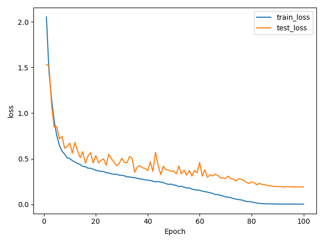
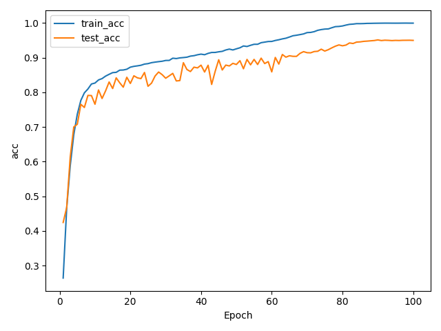
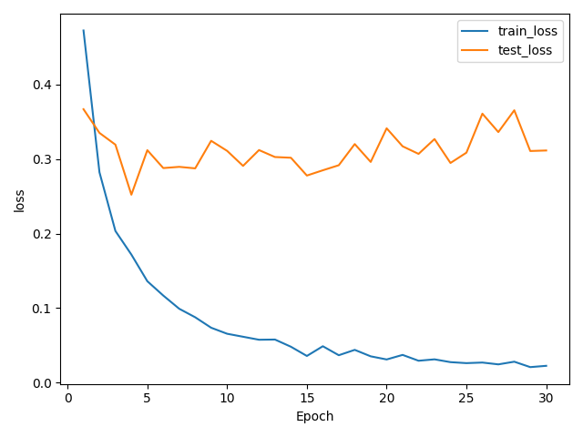
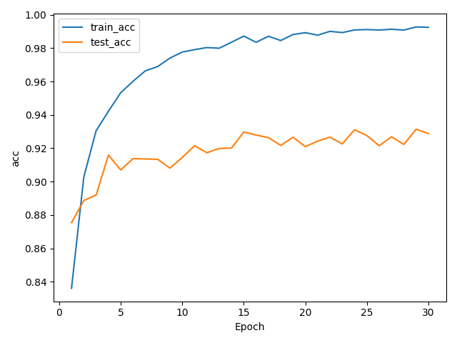

# ResNet-18 CIFAR-10 实验报告

## 1. 任务目标

本实验围绕 CIFAR-10 图像分类任务，完成两个部分：第一，从零训练一个适配 CIFAR-10 小尺寸图像的 ResNet-18 变体；第二，加载 ImageNet 预训练 ResNet-18，在 CIFAR-10 上进行微调。实验重点不是只得到一个分类准确率，而是比较两种训练策略在收敛速度、最终测试准确率、泛化能力和实现复杂度上的差异。

## 2. 数据集与划分

本实验使用 CIFAR-10 官方数据集划分：训练集 50,000 张图片，测试集 10,000 张图片，共 10 个类别。代码中没有额外划分验证集，而是采用官方训练集进行训练，官方测试集用于最终评估。

数据读取方式如下：

```python
train_set = datasets.CIFAR10(data_dir, train=True, download=True, transform=train_tf)
test_set = datasets.CIFAR10(data_dir, train=False, download=True, transform=test_tf)
```

从零训练时，训练集使用 `RandomCrop(32, padding=4)`、`RandomHorizontalFlip()` 和标准化增强；测试集只使用 `ToTensor()` 和标准化，不使用随机增强。预训练微调时，为适配 ImageNet 预训练 ResNet-18 的输入分布，图像被 resize 到 224，并使用 ImageNet 的均值和方差进行标准化。

## 3. 模型设计

### 3.1 从零训练 ResNet-18

原始 torchvision ResNet-18 面向 ImageNet 的 224x224 图像，直接用于 CIFAR-10 的 32x32 图像会过早下采样。因此从零训练版本做了如下修改：

- 将首层 `7x7, stride=2` 卷积改为 `3x3, stride=1, padding=1`。
- 去掉原始 `maxpool`，避免小图像空间信息过快丢失。
- 将最后全连接层输出类别数改为 10。

这种结构更适合 CIFAR-10 的小尺寸图像，也是从零训练结果较好的关键原因。

### 3.2 预训练 ResNet-18 微调

微调实验加载 ImageNet 预训练 ResNet-18，并将最后分类头替换为 10 类输出。该方案利用 ImageNet 预训练特征，因此初期收敛速度明显快于从零训练。由于预训练模型原始输入为 224x224，实验中将 CIFAR-10 图像 resize 到 224 后输入模型。

## 4. 实验设置

| 项目 | 从零训练 | 预训练微调 |
| --- | ---: | ---: |
| Epoch | 100 | 30 |
| Batch size | 128 | 128 |
| Optimizer | SGD + momentum | AdamW |
| Learning rate | 0.1 | 0.001 |
| Scheduler | CosineAnnealingLR | 无 |
| Weight decay | 5e-4 | 1e-4 |
| 输入尺寸 | 32x32 | 224x224 |
| 训练集 | CIFAR-10 train, 50,000 张 | CIFAR-10 train, 50,000 张 |
| 测试集 | CIFAR-10 test, 10,000 张 | CIFAR-10 test, 10,000 张 |

## 5. 实验结果

正式训练结果如下。

| 方法 | 最终 Epoch | 最终训练准确率 | 最终测试准确率 | 最佳测试准确率 | 最佳 Epoch |
| --- | ---: | ---: | ---: | ---: | ---: |
| 从零训练 ResNet-18 | 100 | 99.98% | 95.00% | 95.14% | 90 |
| 预训练 ResNet-18 微调 | 30 | 99.24% | 92.88% | 93.14% | 29 |

对应输出文件：

- `outputs/from_scratch/training_log.csv`
- `outputs/from_scratch/loss_curve.png`
- `outputs/from_scratch/acc_curve.png`
- `outputs/finetune/training_log.csv`
- `outputs/finetune/loss_curve.png`
- `outputs/finetune/acc_curve.png`
- `outputs/results_summary.md`

## 6. 结果分析

### 6.1 从零训练结果分析

从零训练 ResNet-18 最终测试准确率为 95.00%，最佳测试准确率为 95.14%，出现在第 90 个 epoch。该结果明显超过作业中常见的 85% 目标线，说明 CIFAR-10 版 ResNet-18 结构、数据增强和余弦学习率调度是有效的。

从收敛过程看，模型第 1 个 epoch 测试准确率为 42.46%，第 4 个 epoch 达到 70.02%，第 24 个 epoch 达到 85.74%，第 61 个 epoch 达到 90.08%，第 90 个 epoch 达到最佳 95.14%。这说明从零训练前期提升较快，但 90% 以后进入慢速提升阶段，需要较长训练才能继续提高精度。

训练结束时，训练准确率达到 99.98%，测试准确率为 95.00%，泛化差距约为 4.98 个百分点。这个差距说明模型基本拟合了训练集，但测试集准确率仍然稳定在 95% 左右，没有出现严重过拟合。从最后 10 个 epoch 看，测试准确率在 94.94% 到 95.05% 附近波动，说明模型已经基本收敛。

### 6.2 预训练微调结果分析

预训练 ResNet-18 微调最终测试准确率为 92.88%，最佳测试准确率为 93.14%，出现在第 29 个 epoch。相比从零训练，微调模型的最大优势是前期收敛非常快：第 1 个 epoch 就达到 87.54%，第 4 个 epoch 达到 91.59%。这说明 ImageNet 预训练特征对 CIFAR-10 分类具有明显迁移价值。

不过，微调最终结果低于从零训练版本，主要有三个原因。第一，微调模型使用原始 ImageNet ResNet-18 结构，输入需要 resize 到 224，虽然符合预训练分布，但 CIFAR-10 原图只有 32x32，放大后不会产生新的细节。第二，从零训练版本专门改造了首层卷积和下采样方式，更适合小图像分类。第三，微调只训练 30 个 epoch，且没有使用学习率调度，后期测试准确率在 92% 到 93% 附近波动，没有继续提升到 95%。

训练结束时，微调模型训练准确率为 99.24%，测试准确率为 92.88%，泛化差距约为 6.36 个百分点，略大于从零训练模型。这说明微调模型虽然快速拟合训练集，但后期也出现了一定程度的过拟合或测试集性能平台期。

### 6.3 两种方案对比

从零训练的优势是最终准确率更高，结构更适配 CIFAR-10 小图像，配合数据增强和余弦退火学习率后可以达到 95% 左右的测试准确率。缺点是训练时间更长，需要更多 epoch 才能超过 90%。

预训练微调的优势是收敛快，少量 epoch 就能达到较高准确率，适合算力有限或时间有限的场景。缺点是如果直接使用 ImageNet 结构和 224 输入，不一定能超过专门为 CIFAR-10 改造并充分训练的 ResNet-18。

本实验中，从零训练最终测试准确率为 95.00%，比微调模型最终测试准确率 92.88% 高 2.12 个百分点；最佳测试准确率方面，从零训练为 95.14%，微调为 93.14%，差距为 2.00 个百分点。因此，如果目标是最高 CIFAR-10 分类准确率，当前实验设置下从零训练方案更优；如果目标是快速获得可用模型，预训练微调方案更高效。

## 7. 可视化结果说明

训练脚本已经自动保存 Loss 和 Accuracy 曲线：

```text
outputs/from_scratch/loss_curve.png
outputs/from_scratch/acc_curve.png
outputs/finetune/loss_curve.png
outputs/finetune/acc_curve.png
```

报告中可以插入以下图片：

```markdown




```

从曲线应重点观察三点：第一，训练 loss 是否持续下降；第二，测试 accuracy 是否进入平台期；第三，训练准确率与测试准确率之间是否出现明显扩大。如果训练准确率继续上升但测试准确率不再提升，说明模型可能开始过拟合。

## 8. 结论

本次实验完成了 CIFAR-10 上 ResNet-18 从零训练和 ImageNet 预训练微调两种方案。实验结果表明，从零训练的 CIFAR-10 适配版 ResNet-18 最终测试准确率达到 95.00%，最佳测试准确率达到 95.14%；预训练 ResNet-18 微调最终测试准确率为 92.88%，最佳测试准确率为 93.14%。

结论是：预训练模型具有更快的收敛速度，能够在很少 epoch 内取得较高准确率；但在 CIFAR-10 这种小尺寸图像任务中，经过结构适配并充分训练的 ResNet-18 可以获得更高的最终性能。因此，模型结构是否匹配数据集特征，与是否使用预训练同样重要。

## 9. 附录：运行命令

从零训练：

```bash
python src/train_from_scratch.py \
  --epochs 100 \
  --batch-size 128 \
  --lr 0.1 \
  --num-workers 2 \
  --output-dir outputs/from_scratch
```

预训练微调：

```bash
python src/finetune_pretrained.py \
  --epochs 30 \
  --batch-size 128 \
  --lr 1e-3 \
  --num-workers 2 \
  --output-dir outputs/finetune
```

结果汇总：

```bash
python src/summarize_results.py
```
